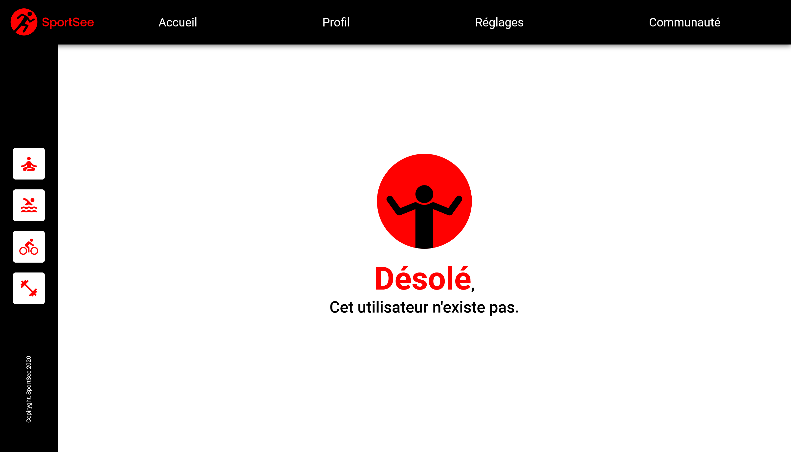

# SportSee

  
  
  
  

Sportsee was a start-up dedicated to sports coaching. It wanted to add personalised tracking using graphs to its user's profile pages. The API calls had to be made using a dedicated service, not from our components. In addition, modelling classes were required to ensure that the data returned by the API was always correctly formatted.

  

  

  

